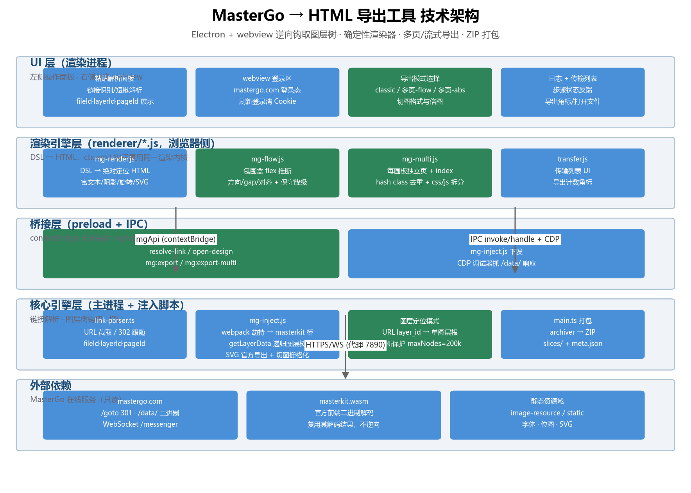
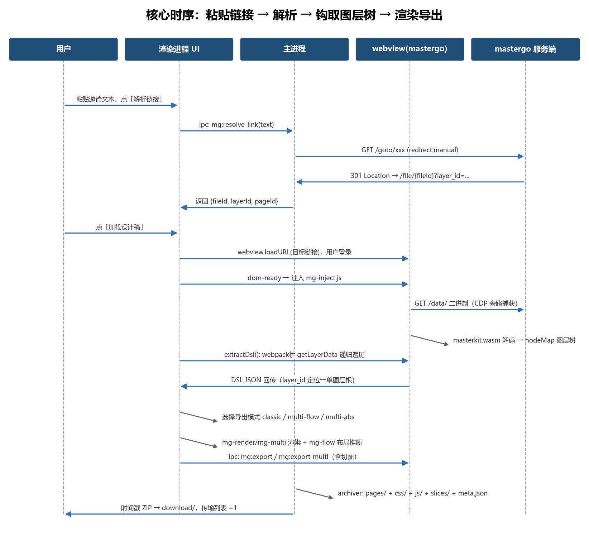
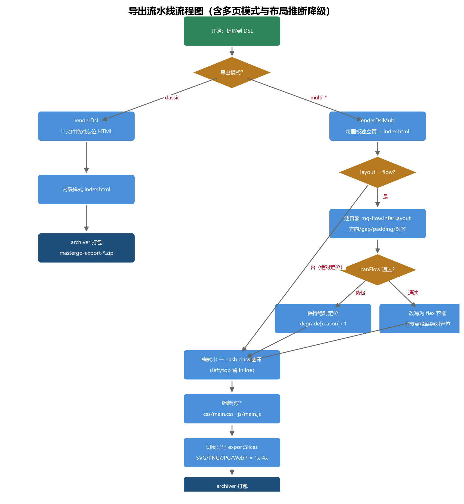

# MasterGo → HTML Exporter

[中文说明](README.zh-CN.md)

An Electron desktop tool that opens a MasterGo design file in an embedded webview, extracts the full layer tree (DSL) through the page's own rendering engine, renders it to a pixel-faithful standalone `index.html`, and packages it with all icon slices into a timestamped ZIP.

## Features

- **Paste-and-go**: parses any pasted text containing a MasterGo link, follows `/goto/` short links (302) and extracts `fileId` / `layerId` / `pageId` — no login required for parsing.
- **In-app login**: the design file opens in an embedded webview; you log in to mastergo.com once and the session persists.
- **Layer-tree extraction (DSL)**: injects an extraction script into the webview that hooks the page's webpack runtime, locates the internal `masterkit` (WASM) bridge, and walks the official `getLayerData` API to rebuild the full layer tree — the same data the MasterGo editor renders with.
- **Official SVG icon export**: vector/icon nodes that carry no fill data are exported through MasterGo's own SVG export module (module `0152`), so icons appear in the HTML exactly as designed — not as outlined paths.
- **Faithful HTML rendering**: absolute-positioned, self-contained single-file HTML — fills (solid/image), borders, corner radius, opacity, inner/outer shadows, blur, rotation/scale, multi-style rich text, and SVG icon backgrounds.
- **Multi-page export (optional mode)**: one HTML page per artboard plus a navigation `index.html`, with html/css/js split into separate files. Two layout engines:
  - **Flow layout inference** (`mg-flow.js`): sibling bounding boxes infer flex direction / gap / padding / alignment / wrap per container, with conservative fallback — any rotation, flip, >15% sibling overlap, mask children, missing sizes, or >40 children degrades that container back to absolute positioning (Anima/FigmaToCode-style "container-level flex + fallback").
  - **Absolute layout**: same split-files structure, all positions preserved exactly.
  - Shared `css/main.css` with hashed dedup classes (position stays inline), `js/main.js` base script (image-fail fallback + `?debug=1` click-to-highlight), `meta.json` board manifest.
- **Slice export**: bulk-exports every complete icon/slice (not fragmented sub-paths) via UI options — SVG / PNG / JPG / WebP, with 1x–4x scale variants.
- **Timestamped ZIP export**: no folder picker; each export writes `download/mastergo-export-YYYYMMDD-HHMMSS.zip` containing:
  - `index.html` — the rendered prototype
  - `slices/<artboard>/<slice>/<name>@Nx.<fmt>` — slices grouped by artboard and slice name, all scales of one slice in the same folder
  - `slices/MANIFEST.md` — a table mapping each slice to its directory and files
- Multi-page mode writes `download/mastergo-multi-YYYYMMDD-HHMMSS.zip` instead: `index.html` (nav), `pages/<artboard>/index.html`, `css/main.css`, `js/main.js`, `meta.json`, same `slices/` layout.
- **Transfer list**: a badge counter on the download icon increments per export; click an entry to reveal the file in Explorer.

## How it works

```
Paste link ──► link-parser (302 resolve) ──► webview loads design ──► inject mg-inject.js
    │                                                                              │
    │            webpack require hijack ──► masterkit bridge (WASM)                │
    │            getLayerData walk ──► layer tree JSON + __svgData (official SVG)  │
    │                                                                              ▼
    └────────────── mg-render.js (DSL → absolute-positioned HTML) ◄──── extractDsl()
                                                   │
                                    exportSlices() ──► rasterize via canvas (PNG/JPG/WebP)
                                                   ▼
                                IPC mg:export ──► archiver ──► timestamped ZIP
```

Extraction strategy (in `app/src/main/mg-inject.js`):

1. **Fetch/XHR interception** — wraps `window.fetch` and XHR to log `/data/` binary responses (diagnostics).
2. **CDP debugger** — attaches to the webview's guest webContents and captures `/data/` response bodies (fallback path).
3. **Webpack bridge (primary)** — hijacks `webpackJsonp.push` to capture `__webpack_require__`, requires the reverse-engineered module IDs (`fcaa` / `ae3a`) to obtain the masterkit bridge, then walks `getPageListVal` → `getAllChildren` → `getLayerData` recursively to rebuild the layer tree.

Rendering (`app/src/renderer/mg-render.js`) converts the tree into inline-styled, absolutely positioned HTML: colors accept both `{red,green,blue,alpha}` and `{r,g,b,a}` field styles, text color falls back from block style to node fills, per-segment `<span>` styles for multi-block text, a Windows-friendly font stack (PingFang SC → Microsoft YaHei), and shadows/blur/borders/radius/opacity.

Multi-page export (`app/src/renderer/mg-multi.js` + `mg-flow.js`) reuses `mg-render.renderNode` through a `ctx.emit` hook: each artboard becomes its own HTML page, every node's style string is split into a hashed dedup class (position stays inline) in shared `css/main.css`, and in flow mode each container with children is tested by `mg-flow.inferLayout` — containers that pass get a flex layout (direction/gap/padding/align/wrap) with children unhooked from absolute positioning, the rest render as-is and their reasons are counted in `stats.degrade`.

## Project structure

```
app/
  src/
    main/
      main.ts          # Electron entry: window, IPC routes, ZIP export (archiver)
      link-parser.ts   # URL extraction + /goto/ short-link resolution (fileId/layerId/pageId)
      mg-inject.js     # Injected into webview: webpack hijack, masterkit bridge, DSL walk,
                       #   official SVG export, slice collection & rasterization
    preload/
      preload.ts       # contextBridge: mgApi (resolveLink/openDesign/extractDsl/exportHtml/...)
    renderer/
      index.html       # UI: link input, step buttons, slice format/scale selectors, log
      renderer.js      # Step orchestration: parse → open → extract → export
      mg-render.js     # DSL → HTML renderer (absolute positioning, inline CSS)
      mg-flow.js       # Flow-layout inference: bounding-box flex detection + fallback rules
      mg-multi.js      # Multi-page export: per-artboard pages, class dedup, index page, assets
      transfer.js      # Transfer list UI with export counter badge
  tsconfig.json
docs/                  # Technical architecture document (docx) + diagrams
download/              # Export output (gitignored)
```

## Getting started

```bash
npm install
npm start        # build (tsc) + launch Electron
```

1. Paste an invited link (e.g. `https://mastergo.com/goto/XXXX?page_id=M&layer_id=3:865`) and click **1. 解析链接**.
2. Log in to mastergo.com in the embedded webview on the right, then click **2. 加载设计稿**.
3. Click **3. 提取图层树 DSL** (injection happens automatically on page navigation).
4. Choose the export mode — **classic** (single file, absolute) / **multi-flow** (multi-page + split files + flow inference) / **multi-abs** (multi-page + split files, absolute) — plus slice format (SVG/PNG/JPG/WebP) and scales (1x–4x), then click **4. 导出 HTML**.
5. Find the ZIP under `download/`; the transfer-list badge shows `+N` per export.

### Proxy

All traffic (main process and webview) goes through `MG_PROXY`, defaulting to `http://127.0.0.1:7890`. Set your own before launching:

```bash
MG_PROXY=http://127.0.0.1:1080 npm start
```

### Visual regression

Screenshot an export, then pixel-diff against a baseline (pixelmatch) after changing render rules:

```bash
npm run shot -- download/mastergo-export-XXXX.zip tmp-new.png   # screenshot
npm run diff -- tmp-base.png tmp-new.png                        # writes tmp-diff.png, exit 1 on diff
```

Smoke test (DSL render assertions, classic + multi-page modes): `node tests/smoke.mjs`; ZIP render checks: `node tests/compare-zip.mjs`.

### Notes & limitations

- Requires an invited/shareable MasterGo file link and login inside the webview.
- The webpack module IDs (`fcaa`/`ae3a`, SVG export module `0152`) are reverse-engineered from the MasterGo frontend bundle and may change if the site updates; the injector falls back to scanning the module cache when IDs drift.
- Image fills reference the MasterGo CDN (`image-resource.mastergo.com`) directly, so viewing the exported HTML offline needs network access for photos.
- Windows only in practice (proxy switch + Explorer integration); the font stack maps PingFang SC to Microsoft YaHei when the original font is unavailable.

## Documents

- [技术架构文档](docs/技术架构文档.docx) — architecture / sequence / flow diagrams (`docs/arch_diagram.png`, `docs/seq_parse_export.png`, `docs/flow_export_pipeline.png`). Spec lives in `docs/diagrams.json`; regenerate with `python tools/gen_diagrams.py`.

### Architecture



### Core Sequence



### Export Pipeline



## Disclaimer

This project is for **learning and reference only** and must not be used for any commercial purpose. It depends on MasterGo's unofficial internal interfaces, which may change at any time; the authors assume no liability for any consequences arising from its use. All trademarks belong to their respective owners.
